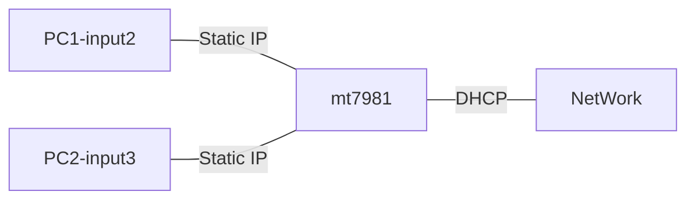

# 20240603 ArkTest-Report
## 測試目的
檢測mt7981上的ARK是否正常運作
## 環境確認
確認網路環境為1000/600Mbps(SpeedTest:943/623Mbps)

架構:

## 遇到異常
| 所在頁面|位置  | 異常  | 種類  |
| - | - | - |-|
| Dashboard | Total  Collection  by Category|按"Clear"Buttom後會跳出兩個通知|UI異常|
|IAM | Device Mode|切到by Device List後add， 但不輸入valid Mac Address， 切回All Device後按Apply會ERROR|UI異常|
| Green Channel|Control|Mac Address為空或invalid都會Apply Success|UI異常|
|SafeSearch | Device Mode|跟IAM-Device Mode一樣問題|UI異常|
|System | Ark|Ark開關時會跳出兩個通知|UI異常|
|QoE | bandwith|bandwith設為0時，會視同QoE未開啟|程式異常|
|Dashboard | Category|下載POE時，其priority顯示為Medium+Low|辨識異常|
## 其餘已確認事項
| 所在頁面     | 位置 | 結果     | 備註 |
| ------------ | ---- | -------- | ---- |
| Dashboard    |  ALL    | 正確顯示 |      |
| IAM          |   ALL   | 功能正常 |      |
| GreenChannel |    ALL  | 功能正常 |      |
| SafeSearch   |    ALL  | 功能正常 |      |
| QoE          |    ALL  | 功能正常 | 目前下載頻寬為 150、300、500、1000Mbps時皆正常     |